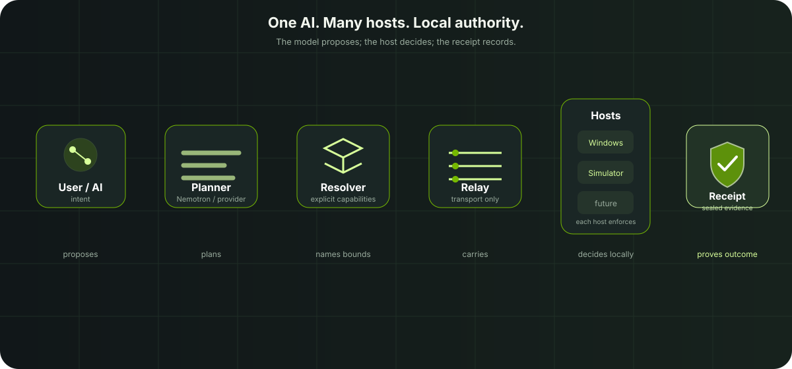
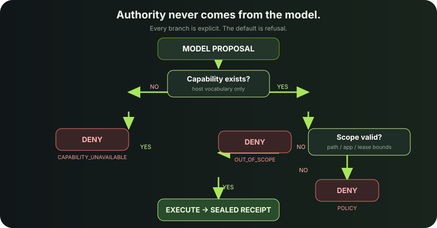
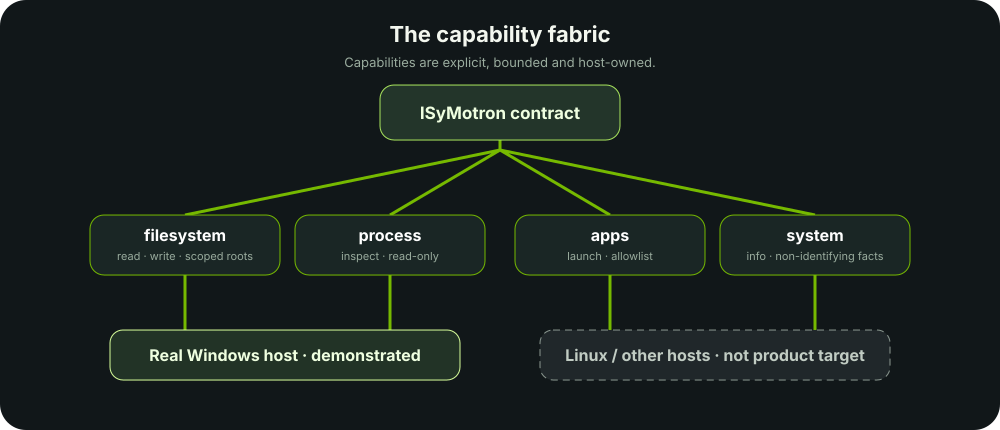

<div align="center">


# ISyMotron

### One AI. Many hosts. One capability fabric.

**Plan with Nemotron. Execute through explicit capabilities. Keep authority local. Verify every action with receipts.**

[](https://github.com/DannyBaanks/IsyMotron/actions/workflows/ci.yml)
[](LICENSE)
[](https://github.com/DannyBaanks/IsyMotron/releases)
[](docs/PLATFORM_SUPPORT.md)
[](docs/PLATFORM_SUPPORT.md)
[](#what-is-demonstrated)

<sub>Hackathon project for the Nebius × NVIDIA / Devpost challenge. `docs/GUIA.es.md` is supplementary Spanish documentation; all submission materials are in English.</sub>

</div>

> The model proposes. The local host decides. Execution produces evidence.

## Get it

| Platform | Download | What it is today |
|---|---|---|
| **Windows 10/11** | `IsyMotron.exe` | Real host (`nt-real`), the reference platform |
| **Linux x86_64** | `IsyMotron-linux-x86_64.tar.gz` | Real host (`linux-real`), parity with Windows [row by row](docs/PLATFORM_SUPPORT.md#parity-what-the-same-means-m2) |
| **macOS (Apple Silicon)** | `IsyMotron-macos-arm64.tar.gz` | Engineering build: console and contract on simulated fixtures; no real host yet |

All three come from [Releases](https://github.com/DannyBaanks/IsyMotron/releases)
with `SHA256SUMS.txt`, a Sigstore attestation per asset and a smoke receipt per
platform. No Python needed to run them; from source, only the standard library.

```bash
sha256sum -c SHA256SUMS.txt
gh attestation verify IsyMotron-linux-x86_64.tar.gz --repo DannyBaanks/IsyMotron
```

## Why this matters

AI should not gain authority merely because it can reason.

ISyMotron gives an agent a typed capability fabric instead of raw host access:
filesystem roots, process inspection, allowlisted applications and system
facts. Every request is checked locally, every refusal is explicit, and every
execution ends in a tamper-evident receipt.

```text
model proposes  →  local authority decides  →  receipt records
```

## Architecture



ISyMotron separates interpretation from authority:

- Nemotron and the provider live in the planning plane.
- The contract, leases, scopes and enforcer live at the host boundary.
- The relay transports requests; it does not grant permission.
- The host executes only after local policy accepts the request.
- The receipt carries the decision, result, observed effects and seal.

## Authority never comes from the model



The model cannot mint a capability, widen a lease, create a grant or seal a
receipt. An ungranted capability is absent from the agent's catalogue. A
malformed request, expired lease, invalid scope or host-level escape is denied
without returning the protected payload.

## See it in 60 seconds

```text
1. Grant a narrow capability        →  filesystem.read on one root
2. Let Nemotron plan                →  typed capability request
3. Execute an in-scope action       →  ALLOW + observed result
4. Try an out-of-scope action       →  DENY + no payload
5. Inspect the receipt              →  seal verified
```

### Real project evidence

The video below is a real ShitVid + OBS capture of the judge-facing demo. The
generated hero above remains illustrative artwork, not proof of a product run.

<div align="center">
<video controls width="720" poster="docs/assets/hero.png">
  <source src="isymotron-demo-final.mp4" type="video/mp4" />
  <a href="isymotron-demo-final.mp4">Watch the ISyMotron demo video</a>
</video>
<br /><sub>ShitVid + OBS demo: policy check, sealed capability lease and explicit host denial.</sub>
</div>

## What is demonstrated

The project uses the evidence vocabulary from [`docs/EVIDENCE.md`](docs/EVIDENCE.md).
The labels below are deliberately narrower than marketing claims.

| Claim | Status | Evidence |
|---|---|---|
| Deny-by-default contract with leases, scopes and sealed receipts | **DEMONSTRATED** | [`tests/test_m0_gate.py`](tests/test_m0_gate.py) |
| Real filesystem and process surface on a Windows host | **DEMONSTRATED** | [`tests/test_win11_real.py`](tests/test_win11_real.py), [`evidence/M1/`](evidence/M1/) |
| Real Linux host with the same contract (`linux-real`) | **DEMONSTRATED** | [`tests/test_linux_real.py`](tests/test_linux_real.py), CI on `ubuntu-latest` |
| Windows ↔ Linux host parity, one scenario table on both CIs | **DEMONSTRATED, scoped** (the case-folding row differs by design) | [`tests/test_host_parity.py`](tests/test_host_parity.py), [`docs/PLATFORM_SUPPORT.md`](docs/PLATFORM_SUPPORT.md) |
| Binaries for Windows, Linux and macOS, smoke-tested per OS, hashed and attested | **DEMONSTRATED** | [`build_exe.py`](build_exe.py), [`.github/workflows/release.yml`](.github/workflows/release.yml) |
| Runtime is Python standard library only | **DEMONSTRATED** | [`tests/test_png_codec.py`](tests/test_png_codec.py) imports the runtime with site-packages hidden |
| Planner refuses hallucinated or ungranted capabilities | **DEMONSTRATED** | [`tests/test_planner.py`](tests/test_planner.py) |
| Live Nemotron planning path (Nebius Token Factory) | **DEMONSTRATED, scoped** | [`tests/test_live_model.py`](tests/test_live_model.py), [`evidence/M3/RUN.md`](evidence/M3/RUN.md), [`evidence/M3/hashes.json`](evidence/M3/hashes.json) |
| Host-awareness attribution: suspend is not provider failure | **DEMONSTRATED** | [`tests/test_awareness.py`](tests/test_awareness.py), [`docs/HOST_AWARENESS.md`](docs/HOST_AWARENESS.md) |
| Console and read-only avatar authority channel | **DEMONSTRATED** | [`tests/test_console.py`](tests/test_console.py), [`tests/test_avatar_adversarial.py`](tests/test_avatar_adversarial.py), [`evidence/AV9/`](evidence/AV9/) |
| Malbolge lesson with machine verdicts and sealed receipts | **DEMONSTRATED, scoped** | [`learning/`](learning/), [`evidence/MALBOLGE_V0/`](evidence/MALBOLGE_V0/) |
| Nebius Token Factory provider execution | **DEMONSTRATED** | Sealed keyed run 2026-09-22: round trip, plan and adversarial refusal all pass. [`evidence/M3/RUN.md`](evidence/M3/RUN.md), [`evidence/M3/hashes.json`](evidence/M3/hashes.json) |
| Receipts verifiable by re-derivation (Quine Gate) | **DEMONSTRATED, scoped** | [`tests/test_quine_gate_rederivation.py`](tests/test_quine_gate_rederivation.py), [`evidence/QUINE_GATE/RUN.md`](evidence/QUINE_GATE/RUN.md) |
| Process identity: instance + artifact drift, with sealed baselines | **DEMONSTRATED, scoped (Linux full; Windows launch-time identity)** | [`tests/test_process_identity.py`](tests/test_process_identity.py), [`docs/PROCESS_VERIFIER.md`](docs/PROCESS_VERIFIER.md) |
| A real Windows 10 host | **NOT_DEMONSTRATED** | Windows 11 is the demonstrated real host; Windows 10 remains the product target |
| A real macOS host | **NOT_DEMONSTRATED** | The macOS binary starts on fixtures and says so; `MacHost` is M3 |
| Universal security or production safety on arbitrary hosts | **NOT_DEMONSTRATED** | Explicitly outside the evidence scope |

## Learn Malbolge with Malbolgato

<p align="center">
  
</p>

Malbolge is named after the eighth circle of Dante's Inferno. Published in 1998
with nothing but a reference interpreter, it became the language where the first
"Hello World" was **not written by a human — it was found by an automated beam
search** (Lou Scheffer). It is widely described as the hardest programming
language ever put on a machine.

**IsyMotron teaches it anyway — and grades you with machinery, not opinions.**

The first lesson is source encoding: every printable character in a Malbolge
program decodes to an instruction *depending on where it sits*:

```text
    op    = (ASCII(char) + c) mod 94       the decode, at position c

    r     = (op - c) mod 94                the inverse: you choose the
    ASCII = r        if 33 <= r <= 93        instruction, you derive the
    ASCII = r + 94   if 0  <= r <= 32        character
    char  = chr(ASCII)
```

The cat asks, you answer. Then three real machines take your answer — none of
them is a model:

```text
      your '3'
         |
         +-- classic_codec.decode ....... opcode 68 (nop)
         |      the positional codec, vendored byte-for-byte (sha256 recorded)
         |
         +-- malbolge-oracle XLAT1 ...... reference instruction 'o'
         |      reference semantics transcribed from the 1998 interpreter
         |      without consulting any other implementation
         |
         +-- Oracle.run ................. a 19-cell program with YOUR
                character at position 17 runs on the reference machine:
                halted, reason=halt_opcode, 19 steps
         |
         v
  VERDICT: PASS   (verdict_source: machine; receipt rcpt_091a3441c935452f; seal ok)
```

That last line is real output, captured on this repository. The receipt id is
generated fresh on every run; the sealed verdict is what matters. Every outcome
is a tamper-evident `learning-receipt-v1`:

| your answer | the machines say | verdict |
|---|---|---|
| `3` | opcode 68 (nop) — reference `'o'`, clean 19-step halt | **PASS** |
| `4` | opcode 69 — not nop | **FAIL** |
| `zz` | out of contract | **INVALID** |
| *(tooling unloaded)* | no tooling, no verdict | **UNAVAILABLE** |

**CAT SPEAKS. TOOLING PROVES.**

- No model is anywhere in the verification path. The lesson passes with no API
  key at all — a lesson that needed a paid opinion to grade you would be
  architecturally wrong.
- No tooling, no verdict: an unloaded verifier answers `UNAVAILABLE`, never
  "the model said it was right".
- A receipt whose verdict is edited breaks its own seal. That is a test.
- The cat announces the machine's verdict live through the open channel — a
  bubble it can speak but never forge.

```powershell
isymotron learn malbolge                     # the whole lesson, interactive
isymotron learn malbolge --exercise 1 --answer 3
isymotron learn malbolge --all               # every exercise, interactive
isymotron learn malbolge-advanced --all      # L3-L13, interactive
```

Verdicts, provenance and the capability roadmap (L0–L13, each mapped to the
discovered tooling behind it): full write-up in
[`docs/MALBOLGE.md`](docs/MALBOLGE.md), the executed runs in
[`evidence/MALBOLGE_V0/RUN.md`](evidence/MALBOLGE_V0/RUN.md) and the discovery
inventory in
[`evidence/MALBOLGE_V0/capability_map.md`](evidence/MALBOLGE_V0/capability_map.md).
The vendored tooling is recorded byte-for-byte in
[`learning/packs/malbolge/vendor/PROVENANCE.md`](learning/packs/malbolge/vendor/PROVENANCE.md).

What V0 claims is exactly what was demonstrated: **learn → build → execute →
verify → receipt**, on a real lesson, with machine verdicts — not "IsyMotron
masters Malbolge". The rest of the curriculum is earned one milestone at a time.

## The capability fabric



The current Windows host exposes a small, inspectable contract:

| Capability | Bounds |
|---|---|
| `filesystem.read` | Granted roots; files and directory metadata |
| `filesystem.write` | Granted roots; explicit create/overwrite |
| `apps.launch` | Case-insensitive executable allowlist |
| `process.inspect` | Read-only process names |
| `system.info` | Non-identifying machine facts |

The contract is intentionally small. Adding a ninth operation is a contract
version change, not an invisible feature.

## Built with Nebius + NVIDIA

ISyMotron includes a provider seam for NVIDIA NIM and Nebius Token Factory —
and, through the same protocol, local models (below):

```text
Nebius or NVIDIA endpoint
          ↓
       Nemotron
          ↓
        Planner
          ↓
     Host policy
          ↓
        Receipt
```

The provider changes how a plan is proposed; it does not change the grants,
scope bounds or authority held by a host. Nebius Token Factory is demonstrated
live and sealed: [`evidence/M3/RUN.md`](evidence/M3/RUN.md) (2026-09-22) records
a real round trip, a real plan and a real adversarial refusal, with
[`evidence/M3/hashes.json`](evidence/M3/hashes.json) sealing the artifacts. The
same seam also reaches NVIDIA NIM (`evidence/M3/probe_nvidia.json`); its earlier
`HTTP 503` is kept as a historical negative result.

### Local models: Ollama and llama.cpp

The same seam plans with a model on your own machine — Llama, Qwen, or anything
[Ollama](https://ollama.com) or llama.cpp's `llama-server` serves. No key, and
the prompt never leaves the computer (physical paths never left it anyway: the
catalogue names only `hostfs://` resources).

```bash
ollama serve & ollama pull llama3.1:8b
ISYMOTRON_PROVIDER=ollama python3 -m console          # or: isymotron keys set ISYMOTRON_PROVIDER
```

A smaller model plans worse; it never reaches further. Invented capabilities
are refused by the planner and anything out of scope by the host — the
[`local-model`](.github/workflows/local-model.yml) workflow runs a real
`llama3.2:1b` against exactly that. Details: [`docs/PROVIDERS.md`](docs/PROVIDERS.md).

## Verification

The CI workflow runs the suite on Windows, Linux and macOS. Windows is the
reference, because the real host gate exercises Windows filesystem semantics,
NTFS junctions and process state; Linux and macOS prove the core is portable.
Each OS also builds the packaged binary and runs its smoke test. A binary that
starts is not a host: Windows and Linux have real host engines (Linux since M2,
with a shared parity suite); macOS has none yet and is `NOT_DEMONSTRATED` as a
host ([`docs/PLATFORM_SUPPORT.md`](docs/PLATFORM_SUPPORT.md)).

The runtime is standard-library only. Tests need `requirements-dev.txt`
(pytest, and Pillow as the PNG test oracle).

```powershell
# From the repository root on Windows
py -m pip install -r requirements-dev.txt
py -m pytest -q
py tests/test_m0_gate.py -q
py tests/test_win11_real.py -q
py tests/test_planner.py -q
py tests/test_console.py -q
```

```bash
# Linux (or macOS for everything but the host gates)
python3 -m pip install -r requirements-dev.txt
python3 -m pytest -q
python3 -m pytest -q tests/test_host_parity.py tests/test_linux_real.py
```

The live provider tests run only when a provider key is present; otherwise they
skip without making the offline contract suite depend on an external service.
The exact current count belongs to the CI run, not to a hand-maintained badge.

## Command line

Every action in this repository is reachable from one command, and its verb
table is the single source of truth — a test fails if an entrypoint is left
unreachable:

```bash
isymotron                      # menu when a terminal is attached; help otherwise
isymotron host status          # what this machine is and grants
isymotron keys set NEBIUS_API_KEY
isymotron evidence verify evidence/M3/hashes.json
isymotron quine demo           # the live Quine Gate sequence
isymotron process verify <pid> --baseline proc.baseline.json
```

Keys are stored outside the repository and never echoed. The CLI holds no
authority of its own: granting still goes through `isymotron host grant` or the
console. Full table, exit codes and the key model:
[`docs/CLI.md`](docs/CLI.md).

## Quine Gate: evidence that reproduces itself

A receipt is an *affirmation*; the authority is the reproduction. An
execution receipt carries the digests of what produced it — request, policy
state, capability, result — and points at its *claim bundle*. The verifier
re-runs the real `Enforcer` over that claim and compares: a `DENY` edited into
`ALLOW` and re-sealed is rejected even though its own seal is self-consistent.

The full live sequence (legit → PASS, mutate → REJECT, fork → CONFLICT,
rollback → CONFLICT, reproduce → PASS) runs with one command and leaves a
sealed package behind:

```bash
python3 tools/quine_gate_demo.py        # writes + verifies evidence/QUINE_GATE/
python3 tools/quine_gate_verify.py evidence/QUINE_GATE \
    --genesis <from evidence/QUINE_GATE/RUN.md> --head <from RUN.md>
```

The report never says "secure". Each property is stated on its own —
`reproducibility: PASS`, `anchor: PASS`, and, honestly,
`occurrence: NOT_DEMONSTRATED`, `host_attestation: ABSENT`. Reproduction
proves the decision is a function of the anchored inputs; it does not prove
the run happened. Architecture and threat matrix:
[`docs/QUINE_GATE.md`](docs/QUINE_GATE.md).

## Process Verifier: is this the process I authorized?

The same volume-verifier pattern — observations → fingerprint → strength tier
→ verdict — applied to a running process. It answers two questions a pid alone
cannot: *is this the same instance* (pid reuse is caught), and *is it still the
same artifact* (a binary deleted or replaced under a live process is caught).

```bash
python3 tools/process_verify.py store  <pid> --baseline proc.baseline.json
python3 tools/process_verify.py verify <pid> --baseline proc.baseline.json
```

Honest boundaries, measured: the executable hash is the **file**, not the
memory image; a malicious process has a perfectly verifiable identity; and
`ps` and `/proc` are one kernel layer, so corroboration is single-layer and
there is no `STRONG` tier. Linux is `DEMONSTRATED` in full; Windows is
`DEMONSTRATED` scoped to launch-time identity (`WindowsProcessSource` plus the
`apps.launch` seal: same single layer, `exe_deleted` always `False`). See [`docs/PROCESS_VERIFIER.md`](docs/PROCESS_VERIFIER.md).

## Quickstart

### Windows 10/11

**Prebuilt:** `IsyMotron.exe` from [Releases](https://github.com/DannyBaanks/IsyMotron/releases)
(Windows 10/11, no Python required) — the stable
[v1.0.0](https://github.com/DannyBaanks/IsyMotron/releases/tag/v1.0.0), or the
[v1.1.0-rc.1](https://github.com/DannyBaanks/IsyMotron/releases/tag/v1.1.0-rc.1)
candidate. It is the same binary the CI builds and smoke-tests on every run.

Or build from source:

```powershell
git clone https://github.com/DannyBaanks/IsyMotron.git
cd IsyMotron

.\isymotron.ps1 help
.\isymotron.ps1 start --demo-host
```

Make a real Windows machine inert until a human grants a scope:

```powershell
.\isymotron.ps1 host status
.\isymotron.ps1 host grant filesystem.read --root "C:/Users/you/Pictures"
.\isymotron.ps1 host do filesystem.read --path "C:/Users/you/Pictures"
.\isymotron.ps1 host do filesystem.read --path "C:/Users/you/Documents" # DENY
```

Optional model planning (Nebius Token Factory is the hackathon path):

```powershell
$env:NEBIUS_API_KEY = "..."
$env:ISYMOTRON_PROVIDER = "nebius"
py tools/nemotron_check.py
# NVIDIA NIM is the same seam: $env:NVIDIA_NIM_API_KEY + ISYMOTRON_PROVIDER = "nvidia"
```

### Linux

A real host since M2 (`linux-real`): same contract, same capabilities, same
two scope checks as Windows, plus Linux-only hardening (case-sensitive
resolved paths, descriptor re-check, `O_NOFOLLOW` writes, no FIFOs, no
overwrite of hard-linked files).

Prebuilt:

```bash
tar -xzf IsyMotron-linux-x86_64.tar.gz
./IsyMotron-linux-x86_64/IsyMotron              # console on 127.0.0.1, real host attached
```

From source (Python 3.10+, nothing to install):

```bash
python3 tools/isymotron_cli.py host status
python3 tools/isymotron_cli.py host grant filesystem.read --root "$HOME/Pictures"
python3 tools/isymotron_cli.py host do filesystem.read --path "$HOME/Pictures"
python3 tools/isymotron_cli.py host do filesystem.read --path "$HOME/pictures" # DENY: a different directory on Linux
```

Grants live in `$XDG_CONFIG_HOME/isymotron/grants.json`. What "parity with
Windows" means, row by row: [`docs/PLATFORM_SUPPORT.md`](docs/PLATFORM_SUPPORT.md).

### macOS (engineering build)

`IsyMotron-macos-arm64.tar.gz` builds and starts, but only on simulated
fixtures: there is no real macOS host backend yet (M3), and the binary says so
on start.

```bash
tar -xzf IsyMotron-macos-arm64.tar.gz
xattr -d com.apple.quarantine IsyMotron-macos-arm64/IsyMotron   # after verifying the checksum
./IsyMotron-macos-arm64/IsyMotron --demo-host
```

Linux host awareness covers retrospective suspend timing and local interface
state; it does not claim pre-suspend notifications, or a desktop avatar where
Tk is missing.

## Repository map

```text
core/isymotron/     contract, policy, leases, receipts, awareness, Doctor,
                    Quine Gate: seal, claim bundle, chain, genealogy, bundle,
                    process identity
hosts/native.py     the one place that picks this OS's real engine
hosts/windows/      real Windows host, grant file format and power provider
hosts/linux/        real Linux host and power provider
hosts/simulator/    deterministic fixture engines
agents/             provider, planner and executor roles
relay/              transport-only loopback relay
console/            local web console and avatar API
avatar/             trust-separated web/desktop avatar
web/                Next.js surface (optional, requires console backend)
learning/           Malbolge lesson packs and verifiers
evidence/           sealed run artifacts and screenshots
tests/              contract, host, planner, console and adversarial gates
docs/               architecture, findings and operational guides
```

## Security and authority model

- Missing or unreadable grants produce an inert host, not an unrestricted one.
- A remote console may use granted authority but cannot widen it.
- The avatar has a separate read-only token and cannot POST authority actions.
- Receipts are produced for both `ALLOW` and `DENY` outcomes.
- A receipt's authority is reproduction, not its seal: the verifier re-runs the
  policy over the anchored claim, so a re-sealed `DENY→ALLOW` is rejected
  ([`docs/QUINE_GATE.md`](docs/QUINE_GATE.md)).
- A denied receipt has no protected result payload.
- The Python sandbox/Doctor is a scoped verification provider, not a universal
  OS security boundary; see [`docs/SANDBOX_V0.md`](docs/SANDBOX_V0.md).
- The engine re-checks every path after the OS resolves it, and a scope check
  follows its filesystem's idea of identity: case-insensitive on NTFS,
  case-sensitive on Linux ([Finding 10](docs/FINDINGS.md)).
- On Linux the opened descriptor itself is re-checked, closing the window
  between resolving a name and opening it. On Windows, network paths, device
  paths, NTFS alternate data streams and that same race remain explicitly
  unverified; see [`docs/FINDINGS.md`](docs/FINDINGS.md).

## Roadmap

| Milestone | Status |
|---|---|
| M1 — three-platform build, release, checksums, attestations; stdlib-only runtime | **done** (v1.1.0-rc.1) |
| M2 — real Linux host with demonstrated parity | **done** (v1.1.0-rc.1) |
| M3 — real macOS host (APFS case-folding needs its own answer) | next |
| M4 — network relay with secure pairing, replacing the loopback relay | planned |
| M5 — mobile approver app: approves leases and reads receipts, never executes | planned |
| Real Windows 10 verification | open |

## License

ISyMotron is released under the [MIT License](LICENSE).

## Asset provenance

The README artwork and evidence screenshots are catalogued in
[`docs/assets/PROVENANCE.md`](docs/assets/PROVENANCE.md). The hero is generated
illustration only; it is not a screenshot, benchmark or proof of execution.
